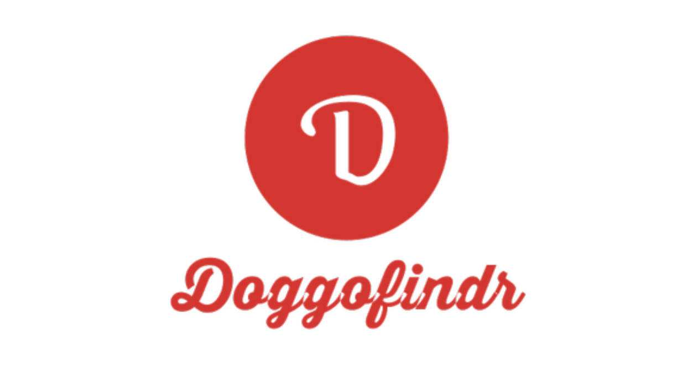

# SWDV-691-Doggo-Findr
# Software Development Capstone - DoggoFindr

## Description
Capstone Project Requirements
You are to design, develop, and deploy a web application. What the application does, or what it is used for, is up to you. It could be a game (e.g., the Spaceman game where you guess letters), a CRUD application for a common storage problem (e.g., a customer contact tracker where you input and retrieve customer interactions), or another type of application you conceive. What matters is that the context of the application is useful or meaningful to you. You are welcome to discuss and solicit ideas from your peers, but please note that your final application idea, and a description of the Minimum Viable Product, will need to be approved by the instructor.

For the purposes of this project, your web application will consist of at least three architecture components:

User Interface
Database
Service Layer(s)
The complexity and design requirements of each component are described in the linked assignments, however, it will be required for you to design, document, implement, and test each component. Further, it will be necessary to plan out the resources required for deployment and how they will work in concert.

The application must be deployed.   You will provide me with a URL to grade against.

## Deployed Link
https://tranquil-escarpment-17688.herokuapp.com/
localhost 3001

## Table of Contents
- [Title](#title)
- [Description](#description)
- [Table of Contents](#table-of-contents)
- [Questions](#questions)

## Screenshots

## Questions
Please contact me using one of the following:
    
- Github: [hilaryvalenciawalsh](https://gist.github.com/hilaryvalenciawalsh)   
    
- Email: hilaryvalenciawalsh@gmail.com;